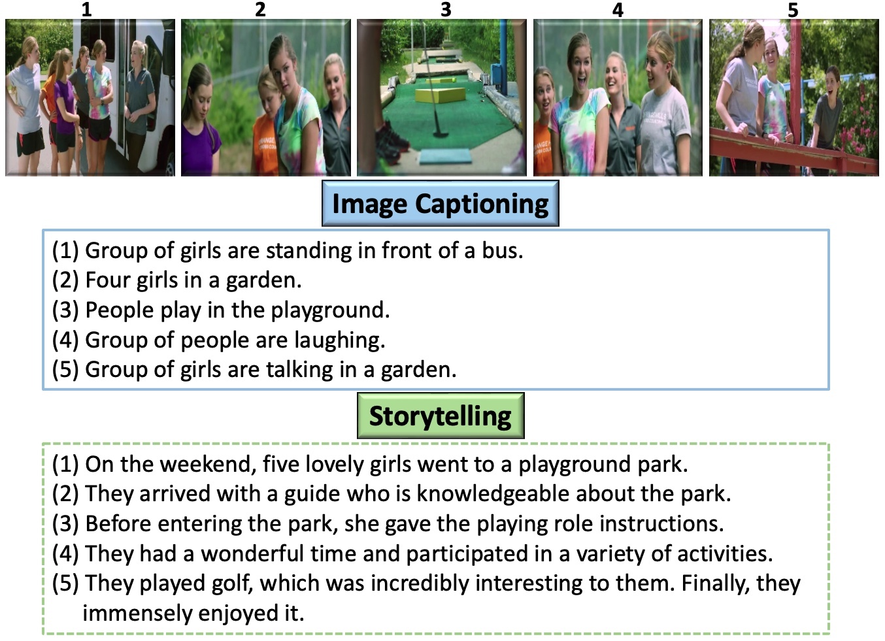

# SEQUENTIAL STORYTELLING IMAGE DATASET (SSID)
The dataset is part of a research paper published in IEEE Access: 

[Sequential Vision to Language as Story: A Storytelling Dataset and Benchmarking](https://ieeexplore.ieee.org/document/10177150/).

 
# introduction:
Visual storytelling refers to the manner of describing a set of images rather than a single image, also known as multi-image captioning. Visual Storytelling Task (VST) takes a set of images as input and aims to generate a coherent story relevant to the input images. In this dataset, we bridge the gap and present a new dataset for expressive and coherent story creation. We present the `# Sequential Storytelling Image Dataset (SSID)`, consisting of open-source video frames accompanied by story-like annotations. In addition, we provide four annotations (i.e., stories) for each set of five images. The image sets are collected manually from publicly available videos in three domains: documentaries, lifestyle, and movies, and then annotated manually using Amazon Mechanical Turk. In summary, SSID dataset is comprised of 17,365 images, which resulted in a total of 3,473 unique sets of five images. Each set of images is associated with four ground truths, resulting in a total of 13,892 unique ground truths (i.e., written stories). And each ground truth is composed of five connected sentences written in the form of a story.

# Instructions: 
The SSID dataset is comprised of 17,365 images, which resulted in a total of 3,473 unique sets of five images. Each set of images is associated with four ground truths, resulting in a total of 13,892 unique ground truths (i.e., written stories). And each ground truth is composed of five connected sentences written in the form of a story. Please go through the attached [PDF file for additional Instructions and details.](assets/SSID_Instructions.pdf)

# SSID Dataset:
[You can download the dataset from here..](https://drive.google.com/drive/folders/1XDK6wVReQziJrJXakgi3_IgvKm8BnYCR?usp=drive_link)

# Citation:
If you use this dataset for your research or project, please cite:

      @ARTICLE{10177150,
            author    ={Malakan, Zainy M. and Anwar, Saeed and Hassan, Ghulam Mubashar and Mian, Ajmal},
            journal   ={IEEE Access}, 
            title     ={Sequential Vision to Language as Story: A Storytelling Dataset and Benchmarking},
            year      ={2023},
            volume    ={11},
            number    ={},
            pages     ={70805-70818}
      }
